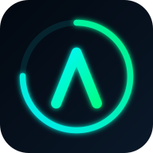

# Fitbit Air Dashboard

Panel biométrico personal con **4 temas visuales** (Minecraft, Halo, Naruto, Futuristic), datos reales de Fitbit y un **coach de IA conversacional (AIRA)**. PWA instalable en el móvil y accesible vía web. Pensado para competir visual y funcionalmente con Whoop / Oura / Apple Fitness.



## 📲 Probar / Instalar en el teléfono

**Producción:** **https://fitbit-dashboard-zeta.vercel.app**

Es una PWA — se instala sin tienda de apps:

- **iPhone (Safari):** abre el link → **Compartir** → **Añadir a pantalla de inicio**
- **Android (Chrome):** abre el link → menú **⋮** → **Instalar app** / **Añadir a pantalla de inicio**

Arranca en modo **demo** (sin login). Para datos reales, toca **Conectar** (ver "Conectar tu Fitbit" abajo).

## ✨ Features

- **Coach AIRA conversacional** — pregúntale sobre tus datos (sueño, entreno, rutinas, nutrición). Gratis; usa Gemini si hay key, si no responde con un motor local
- **Recovery Score** (0–100) estilo Whoop · **Hipnograma** de sueño estilo Oura
- **Stats** con apartados dedicados de **Fitness** (pasos, min. activos, calorías) y **Sueño** (etapas + calidad), badges de estado (HRV/SpO₂/Temp/Estrés)
- **Historial** 7d / 30d / 90d con SVG + flechas de tendencia + caché IndexedDB
- **Datos reales de Fitbit/Google**: FC, RHR, sueño, pasos, zonas + SpO₂, HRV (RMSSD) y ritmo respiratorio
- **AIRA Pro** ($5/mes): coach ilimitado + planes, tema nuevo cada mes, reporte semanal IA (menú comparativo Free/Pro en Perfil)
- **Emparejamiento un-toque** (PKCE, app compartida) — sin que el usuario cree cuenta de desarrollador
- **4 temas** con identidad visual fuerte (incluye easter eggs del tema Naruto) · **Bilingüe** ES/EN
- **PWA** instalable, offline, pull-to-refresh, **safe-area para Dynamic Island**, touch optimizado
- **Notificaciones** locales + server push (Web Push/VAPID)
- **App nativa** iOS/Android vía Capacitor (scaffolding listo)

### 🧩 Sistema de widgets (nuevo)
- **Long-press** en cualquier widget → modo edición estilo iPhone (animación jiggle + badge × para eliminar)
- **Drag & drop** para reordenar widgets (touch y mouse) — orden persiste entre sesiones
- **Resize** por widget: badge ⊞ alterna entre ancho completo (2 col) y medio (1 col)
- **Tarjeta +** siempre visible para reactivar widgets ocultos
- **Grid proporcional**: todos los widgets se estiran para ocupar la misma altura por fila, sin espacios muertos
- **Widgets enriquecidos**: cada métrica tiene barras de zona, sub-métricas secundarias y botón `?` con explicación

## 🏗️ Arquitectura

Frontend vivo: **`public/app.html`** — SPA en JS vanilla con OAuth client-side, IndexedDB y charts SVG. Next.js sirve la SPA y aporta las **API routes** (`app/api/*`). El coach es la primera pieza que consume el backend (`/api/coach`).

```
public/app.html          ← el único frontend (SPA, OAuth, IndexedDB, charts, chat AIRA)
public/{sw.js,manifest}  ← PWA
app/api/coach            ← proxy del coach IA (Gemini, key solo en server) + fallback local
app/api/*                ← push, fitbit proxy, auth, prefs
lib/{push,fitbit,supabase}.ts · supabase/migrations/ · capacitor.config.ts
```

> Ver **`CLAUDE.md`** (referencia técnica) y **`HANDOFF.md`** (estado actual + próximos pasos).

## 🚀 Quickstart

```bash
source ~/.nvm/nvm.sh   # nvm
nvm use                # Node 20+
npm install
npm run dev            # http://localhost:3000  (redirige a /app.html)
```

## 🔌 Conectar tu Fitbit

- **Un-toque (recomendado):** registra UNA app Fitbit tipo **"Client"** con PKCE, pega su Client ID en `SHARED_CLIENT_ID` (en `app.html`) → los usuarios solo tocan "Conectar" (sin cuenta de dev). Pide acceso **Intraday** para HR en vivo.
- **Manual (fallback):** "Opciones avanzadas" → el usuario pega el Client ID de su propia app "Personal".

## ⚙️ Variables de entorno (todas opcionales; sin ellas todo cae a fallback/demo)

| Variable | Para qué | Dónde sacarla |
|---|---|---|
| `GEMINI_API_KEY` | Activa el coach IA real (si falta → fallback local) | aistudio.google.com (gratis, sin tarjeta) |
| `GEMINI_MODEL` | Modelo (default `gemini-2.0-flash`) | — |
| Supabase / VAPID | Server push, prefs en nube | ver `PUSH.md` |

En código: `SHARED_CLIENT_ID` (pairing un-toque) y `DEV_FITBIT_IDS` (Pro gratis para devs) en `public/app.html`.

## 📦 Stack

Next.js 15 · TypeScript · Tailwind · Supabase · Fitbit OAuth 2.0 (PKCE) · Gemini API · Capacitor · Web Push

## 📚 Docs

| Archivo | Para qué |
|---|---|
| `CLAUDE.md` | Referencia técnica (sistemas de app.html, endpoints, convenciones) |
| `HANDOFF.md` | Estado actual, qué falta, cómo continuar |
| `PUSH.md` | Server push (✅ desplegado) — VAPID/deploy/cron |
| `CAPACITOR.md` | Build nativo iOS/Android |

## 🧪 Scripts

```bash
npm run dev         # dev server
npm run build       # next build
npm run typecheck   # tsc --noEmit
npm run cap:sync    # sincronizar web → nativo (Capacitor)
npm run db:push     # aplicar migraciones Supabase
```

## 📍 Estado

Todo el código en `main` y desplegado. Coach IA conversacional, datos reales (SpO₂/HRV/ritmo respiratorio), Stats con Fitness/Sueño, emparejamiento un-toque y suscripción AIRA Pro (Fase 1) están **vivos**. Pendiente de **activación/infra** (no de código): pegar key gratis de Gemini, registrar la app Client de Fitbit, conectar Stripe para cobros reales, y el build nativo (`CAPACITOR.md`). Ver `HANDOFF.md`.

---

Hecho por [@iFrodo7](https://github.com/iFrodo7) · 🤖 con [Claude Code](https://claude.com/claude-code)
